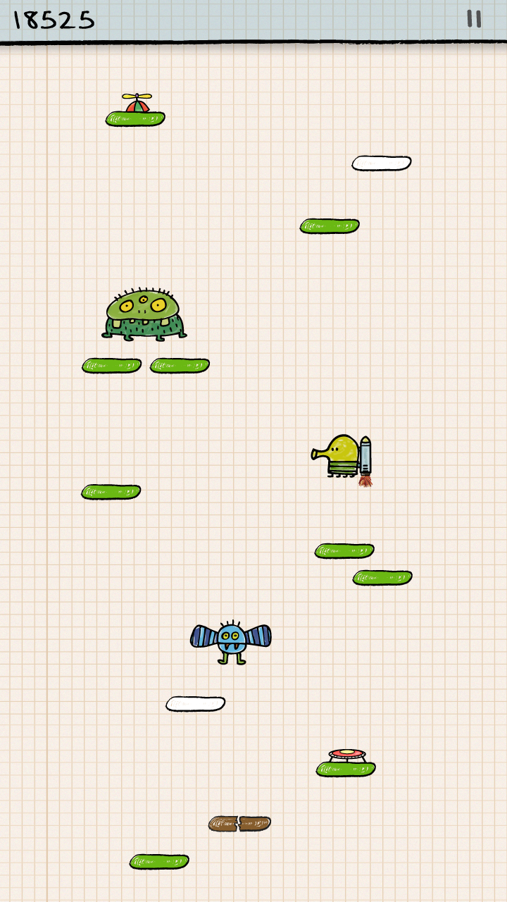

*1. Which library(ies) did you choose? Include link(s).*  
[p5play](https://p5play.org/learn/index.html)

*2. What was your original idea?*  
I'd like to create a simple version of Doodle Jump that allow the player to jump on ascending platforms.  

*3. What did you try?*  
Player and platform [creation](https://p5play.org/learn/sprite.html?page=0).  
[Gravity](https://p5play.org/learn/sprite.html?page=1) affecting the player.  
[Movement](https://p5play.org/learn/sprite.html?page=3) controls with the left and right arrow keys.  
[Collision](https://p5play.org/learn/sprite.html?page=5) detection between the player and the platforms to create a jumping effect.  
Scrolling the platforms downward when the player reaches a certain height.  
Score increment as the player moves up.  
Game over condition when the player falls off the screen.  

*4. What did you end up implementing?*  
I created the game that players can keep jumping on platforms without falling to increase the score.  

*5. What was hard or challenging about using other people’s code?*  
It takes time to figure out the code and implement differnt functions to my design, especially the [Collision](https://p5play.org/learn/sprite.html?page=5). 

